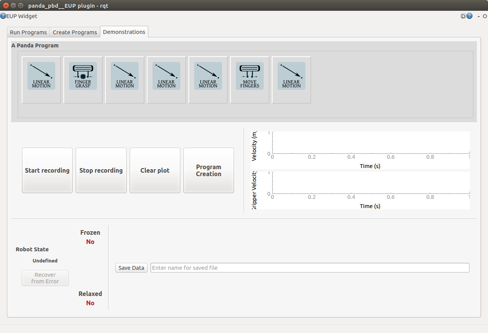
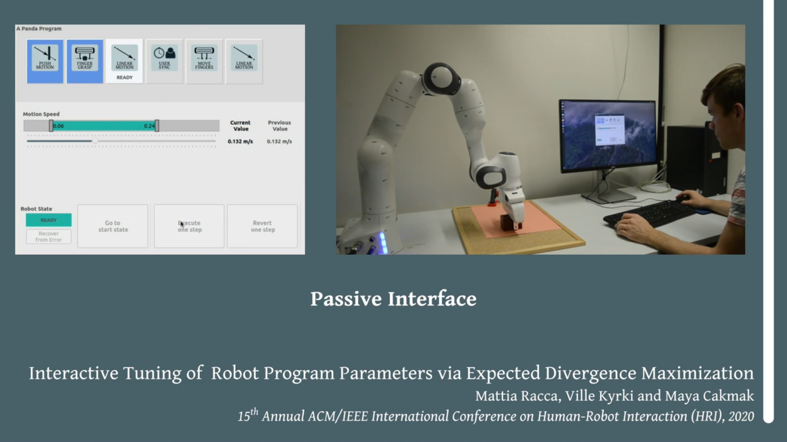

# EUPanda: a End-User Programming framework for the FRANKA Panda

**EUPanda** is a End-User Programming framework for the FRANKA Panda Robot Arm that tries to replicate the proprietary
[Desk environment] in a open source ROS-based fashion.

The framework allows to create from kinestethic teaching robot programs made of 5 primitives:
* move to pose,
* move to contact at pose,
* move fingers,
* apply force with fingers, and
* user synchronization primitive.

Programs can be executed step-by-step or fully; Similarly, primitives can be reverted.




Watch [eupanda] in action!.

## Status

EUPanda development is **stale**:
* The backend (C++/Python) supports creation of programs, creation through kinesthetic teaching, and their execution (and reversion).
* The `master` branch has the GUI (PyQT) used for tuning of already created robot programs (see \[[1]\]).
* The `pbd_gui_development` branch integrates in the GUI the automatic creation of robot programs from unconstrained robot demonstrations (see  \[[2]\]).

For the Active Learning code behind our HRI'20 paper \[1\], please check the [tuning_al_gui] repository.

## References

\[[1]\] Mattia Racca, Ville Kyrki, and Maya Cakmak, **"Interactive Tuning of Robot Program Parameters via Expected Divergence Maximization"**, HRI'20
```bibtex
@inproceedings{racca20,
author = {Racca, Mattia and Kyrki, Ville and Cakmak, Maya},
title = {Interactive Tuning of Robot Program Parameters via Expected Divergence Maximization},
year = {2020},
publisher = {Association for Computing Machinery},
address = {New York, NY, USA},
booktitle = {Proceedings of the 2020 ACM/IEEE International Conference on Human-Robot Interaction},
pages = {629–638},
keywords = {human-robot interaction, end-user programming, active learning},
series = {HRI '20}
}
```
\[[2]\] Petri Kalima, **"Segmentation of Kinesthetic Demonstrations into End-User Robot Programs"**
```bibtex
@mastersthesis{kalima20,
title={Segmentation of Kinesthetic Demonstrations into End-User Robot Programs},
author={Kalima, Petri},
year={2020},
pages={63}
}
```

[1]: https://dl.acm.org/doi/abs/10.1145/3319502.3374784
[2]: https://aaltodoc.aalto.fi/handle/123456789/47148
[tuning_al_gui]: https://github.com/MattiaRacca/tuning_al_gui
[Desk environment]: https://www.franka.de/capability
[eupanda]: https://vimeo.com/mattiaracca/hri20

#### License
Everything authored by me is released under the GNU GPL 3.0 license. Some files are authored by others, and are included
as part of my own setup; they still belong to the original authors.
